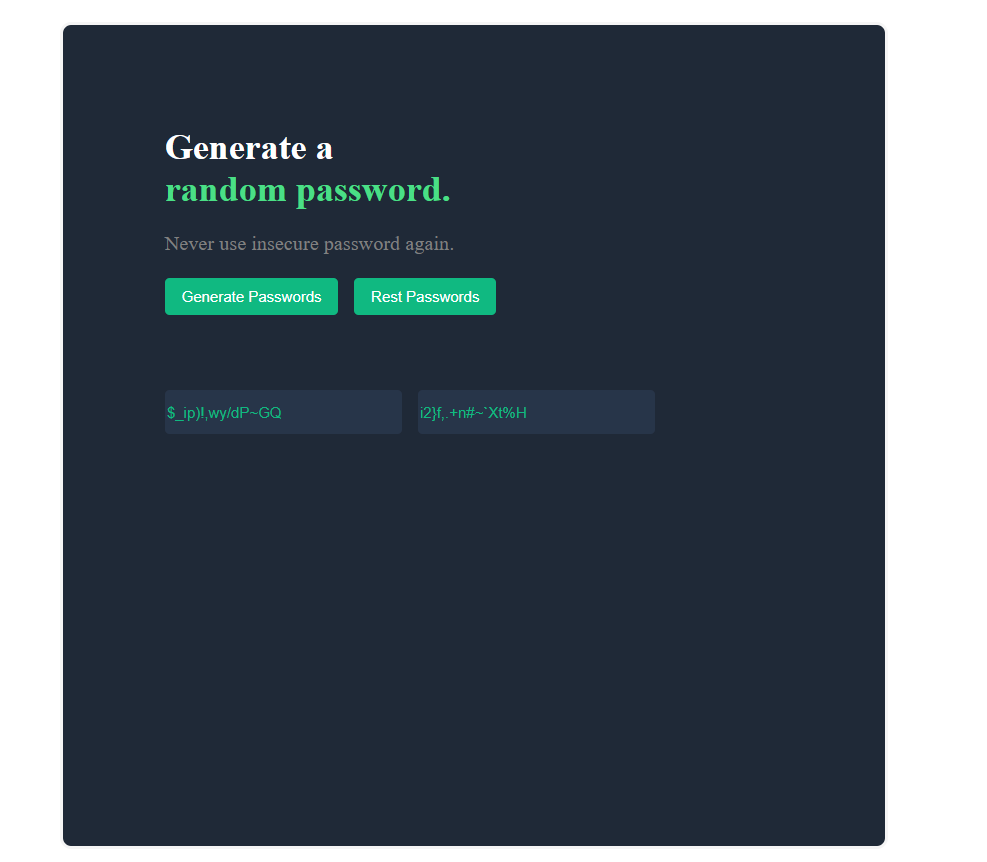

# 🔐 Random Password Generator

A simple and interactive Random Password Generator built using **HTML**, **CSS**, and **JavaScript**. This application generates two secure random passwords instantly to help users create strong passwords.

## 🚀 Features

- Generate two random passwords with one click
- Each password contains 15 random characters
- Includes uppercase and lowercase letters
- Includes numbers and special characters
- Reset generated passwords
- Simple and responsive user interface

## 🛠️ Technologies Used

- HTML5
- CSS3
- JavaScript (ES6)

## 📂 Project Structure

```text
random-password-generator/
│── index.html
│── index.css
│── index.js
│── README.md
```

## ▶️ How to Run the Project

1. Clone this repository:

```bash
git clone https://github.com/chendkapure-vansh/random-password-generator.git
```

2. Open the project folder.

3. Double-click **index.html** or open it in your preferred web browser.

## 📸 Project Preview



## 🎯 Learning Outcomes

Through this project, I practiced:

- JavaScript DOM Manipulation
- Random Number Generation
- Working with Arrays
- String Manipulation
- Event Handling
- HTML & CSS Layout

## 👨‍💻 Author

**Vansh Chendkapure**

GitHub: https://github.com/chendkapure-vansh

---

⭐ If you found this project helpful, consider giving it a star on GitHub!
